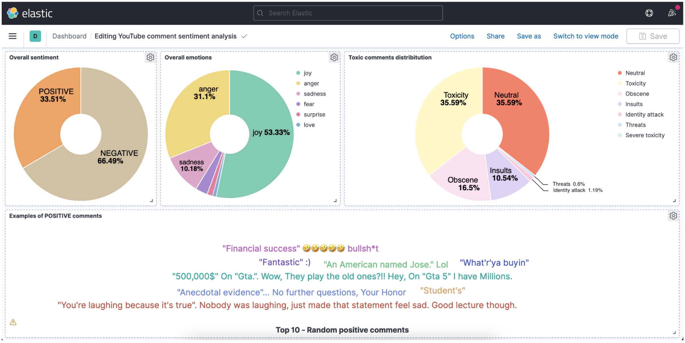

# Youtube-comments-sentiment-Analysis

Sentiment analysis performed on Youtube comments and summarized in a Kibana dashboard.

Keywords: opinion mining

## Abstract
#### Background
Sentiment analysis (or opinion mining) is a natural language processing technique usually performed on textual data to determine whether a piece of data is positive, negative, or neutral. Traditionally, it allows businesses to monitor sentiment in customer feedback and
therefore tailor their products or services to match their customers’ needs. This technique is here applied to YouTube comments to help online content creators monitor their audience’s opinion without reading all the comments under a video. This is particularly useful for those whose content generates thousands to millions of reactions.

#### Aims
This project should allow a channel owner to:
- (1) get an overview of the audience's opinion on a piece of content,
- (2) roughly know what is discussed in the comment section,
- (3) spot intense negative emotions and take actions (report or ban toxic viewers).

#### Method
The key steps of this project are :
- **Data collection** using the Youtube API. Creation of JSON files to design a NoSQL database using Elasticsearch. Each comment is a document and one JSON file is created per video (a reference to the video is stored in the document).
- **Data preprocessing**: text cleaning and comment classification (sentiment, emotion, toxicity and topic) using Tensorflow/ PyTorch.
- **Data analysis**: analysis of the classified comments to answer 3 key questions ;
  1. What are the overall sentiment and emotions ?
  2. What are people talking about ?
  3. Are they any inappropriate comments ? Who is publishing those comments ?
- **Data summarisation** in a Kibana dashboard.

#### Results
Dashboard sentiment, topics and emotions portrayed under a video’s comment section.

#### Limits
- Omitted topic classification (work in progress)
- Challenges: provide support for emoticons, inherent subjectivity, tone, context, and multilingual sentiment analysis.
- Lexicons based emotion detection => system only relies on words’ connotations. Fails to distinguish truly negative (e.g., *your video is so bad*, *your nasal voice is killing me*) and falsely negative comments (e.g., *your videos are always badass, you are killing it !*).
- Truncated comments because of tensor limitations

#### Tools
- Youtube API : data collection (video comments).
- NoSQL with Elasticsearch : for its tokenization feature that allows us to search through text.
- Python Transformers package (based on Tensorflow and PyTorch) for text
classification using different models (sentiment, emotion, toxicity and topic classification).
- Kibana : data visualisation (final dashboard).
- Jupyter notebook : source code and synthetic explanation of our process.
